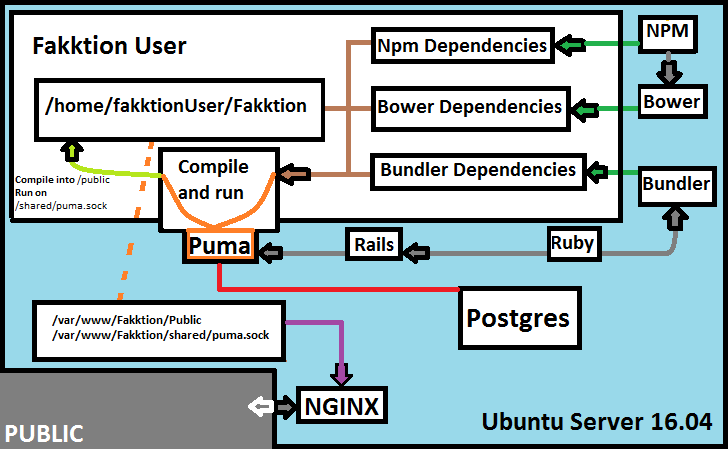

## Ubuntu Server 16.04 Deployment  (**Under Testing**)

## Server Overall Structure

#### Local DB


#### Remote DB


### Deployment Notes
1. This guide is tailored for max performance on running only one app (and its workers) through PUMA while using one single install of Ruby 2.3 with Node.js through NPM (Node Package Manager.) If you plan for multiple apps, you must use RVM (Ruby Version Manager) or Rbenv alongside NVM (Node Version Manager.)
2. I do not recommend dropping usage of Bundler, or other package managers in favor of apt-get. You will face terrible consequences from non-available packages, micro-managing inter-dependencies to lack of edge versions and broken installs with no clear solution. **You have been warned, so do not contact me wondering what went wrong if you did not follow this piece of advise!**
3. This guide sets up the database under the same server. However, it is recommended that you create a separated Postgres Database and connect to it instead by changing the config/database.yml.

### Server Requirements
1. Server with at least 10GB free space.
2. PostgreSQL database installed if you are running the local version.
3. Encrypted home directory.
4. OpenSSH recommended

### Initial Deploy
1. Add the Deploying user through ```sudo adduser DEPLOYINGUSER sudo```.
2. Login as DEPLOYINGUSER.
3. From your home/$deployUser directory, clone repo through ```git clone https://github.com/YOURUSERNAME/Fakktion.git``` (HTTPS instead of SSH suggested as it will make it harder to accidentally push commits back into origin master (or the branch that you use as master.)
4. Navigate to Fakktion/docs folder, and allow Execution access to the main script with ```sudo chmod +x u16deploy.sh```.
5. Now run ```./u16deploy.sh 1``` (Or change $USER to the user where Puma will use to control the app. You must the same user whenever requested from now on.)
6. Now go into USER/Fakktion/config and execute ```sudo nano database.yml```, then change the **username** to DBUSER, **password** to DBPW, and **database** to DBNAME. The next step will setup the database for you, but you will to match the same exact info that you entered in this step.
7. Navigate back to docs folder, and execute ```./u16deploy.sh 2 RemoteConfig? DBUSER DBNAME```. If RemoteConfig is **y**, then no need for DBUSER nor DBNAME.
8. Execute ```sudo ./u16deploy.sh 3``` to setup PUMA Daemon service through init.d.
9. Edit **fakktion_16_ssl.conf** or *fakktion_16_non_ssl.conf** depending on your SSL needs and confirm the NGINX configs.
10. Execute ```sudo ./u16deploy.sh 4 SSL?``` (replace SSL? with y or n) to prepare NGINX for the PUMA socket.
11. ```sudo reboot```, then login as DEPLOYINGUSER.
12. Initiate Puma socket with the final part of the script: ```. u16deploy.sh 5```.

### Troubleshooting Initial Deploy
1. **Ruby version installed is different from the one specified on gemfile.**
If this error happens, then go back to your development machine, and run ```sudo apt-get install -y libpq-dev nginx ruby2.3 rails bundler```. Then, fix the gemfile to the current installed ruby version and run ```rake test```. If all tests works, then push to master followed by pulling on the deployment server and retry the step.

2. **postgres user does not exist, or PostgreSQL related errors.**
Please fix them, or switch to a remote pg database before reattempting the step that failed.

3. **NGINX 403 or similar errors.**
Your NGINX configs is wrong or you may have issues connecting the socket between PUMA and NGINX. With that, I recommend setting up a snapshot of your enviroment and use ```chmod -R 755 /var/log/nginx``` so that you can access the NGINX logs. After you fix the error, you may restore the snapshot and fix the error again or simply restore the previous chmod for /var/log/nginx.

### Checking Logs
1. Puma Cluster log available under app/log/puma.log
2. Puma Stdout and Puma Stdeer logs available under app/shared/log

[Ubuntu Server 16.04 Maintenance](Ubuntu Maintenance16.md)
